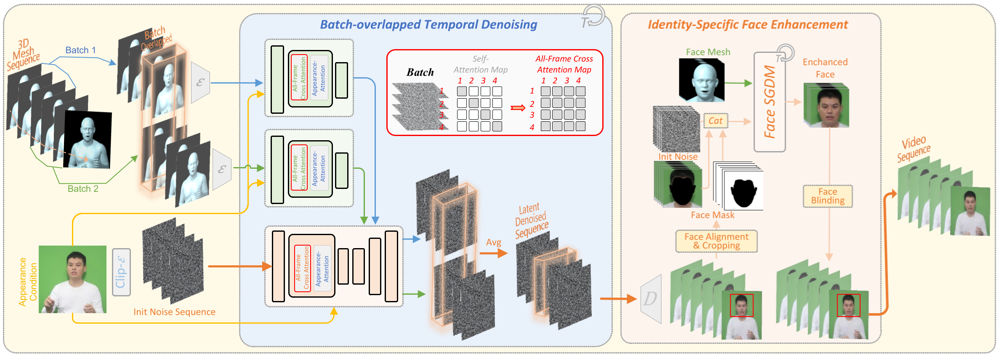

# Make-Your-Anchor: A Diffusion-based 2D Avatar Generation Framework

 

Will appear at CVPR 2024!

## Abstract
Despite the remarkable process of talking-head-based avatar-creating solutions, directly generating anchor-style videos with full-body motions remains challenging. In this study, we propose **Make-Your-Anchor**, a novel system necessitating only a one-minute video clip of an individual for training, subsequently enabling the automatic generation of anchor-style videos with precise torso and hand movements. Specifically, we finetune a proposed structure-guided diffusion model on input video to render 3D mesh conditions into human appearances. We adopt a two-stage training strategy for the diffusion model, effectively binding movements with specific appearances.  To produce arbitrary long temporal video, we extend the 2D U-Net in the frame-wise diffusion model to a 3D style without additional training cost, and a simple yet effective batch-overlapped temporal denoising module is proposed to bypass the constraints on video length during inference. Finally, a novel identity-specific face enhancement module is introduced to improve the visual quality of facial regions in the output videos. Comparative experiments demonstrate the effectiveness and superiority of the system in terms of visual quality, temporal coherence, and identity preservation, outperforming SOTA diffusion/non-diffusion methods. 

## Pipeline

## Video Results
https://github.com/ICTMCG/Make-Your-Anchor/assets/11772240/c72910fb-2eb5-4796-8064-7abfc5f1170f

https://github.com/ICTMCG/Make-Your-Anchor/assets/11772240/2cedf65e-e311-4b04-967a-cede8ed0a75f

## Audio-Driven Results
https://github.com/ICTMCG/Make-Your-Anchor/assets/11772240/89871467-a835-48b5-a43c-8b34efbe4c0b

## Ablations
https://github.com/ICTMCG/Make-Your-Anchor/assets/11772240/64a3f48f-4e94-40ad-816d-0eafadf1adce

## Cross-person Results
https://github.com/ICTMCG/Make-Your-Anchor/assets/11772240/b688e510-f95d-44c5-80f9-cfd774134ec7

## Full-body Results
https://github.com/ICTMCG/Make-Your-Anchor/assets/11772240/644fc444-20db-46d7-a513-cd4cdb2067ba

